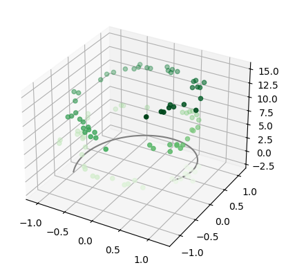

# **Introduction to Tensorflow with Keras**

Welcome to the introductory section of the repository, where we'll dive into the basics of working with some essential tools in data processing and visualization.

## Contents

- **Numpy**: We'll learn how to handle arrays and perform essential mathematical operations for data processing.
- **Pandas**: We'll explore how to load, manipulate, and analyze data efficiently with DataFrames.
- **Matplotlib**: We'll discover how to visualize our data, a key skill for any data analysis or Machine Learning project.
- **Deep Learning Example with Tensorflow and Keras**: We'll put into practice what we've learned by building a basic Deep Learning model to solve a specific problem.

Each section includes practical examples and code that you can run, modify, and explore on your own.

## Contributing

If you have suggestions for improving the examples, or if you want to add new examples that you think could be useful for others, feel free to make a pull request or open an issue!

---

We hope this space will be highly useful for you to learn and experiment with Tensorflow, Keras, and other essential tools in the field of Machine Learning and data science.